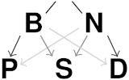

# Model and Simulate Admixed Populations with `bnpsd` 

The `bnpsd` ("Balding-Nichols Pritchard-Stephens-Donnelly") R package facilitates construction of admixed population structures and simulation of allele frequencies and genotypes from the BN-PSD admixture model.
This model combines the Balding-Nichols (BN) allele frequency model for the intermediate subpopulations with the Pritchard-Stephens-Donnelly (PSD) model of individual-specific admixture proportions.
This model enables the simulation of complex population structures, ideal for illustrating challenges in kinship coefficient and FST estimation.
Note that simulated loci are drawn independently (in linkage equilibrium).

## Installation

The stable version of the package is now on CRAN and can be installed using
```R
install.packages("bnpsd")
```

The current development version can be installed from the GitHub repository using `devtools`:
```R
install.packages("devtools") # if needed
library(devtools)
install_github('StoreyLab/bnpsd', build_opts = c())
```

You can see the package vignette, which has more detailed documentation, by typing this into your R session:
```R
vignette('bnpsd')
```

## Example

This is a quick overview of the main `bnpsd` functions.

Define the population structure (in this case for 1D admixture scenario).
```R
library(bnpsd)
# dimensions of data/model
# number of loci
m_loci <- 10
# number of individuals
n_ind <- 5
# number of intermediate subpops
k_subpops <- 2

# define population structure
# FST values for k=2 subpopulations
inbr_subpops <- c(0.1, 0.3)
# admixture proportions from 1D geography
admix_proportions <- admix_prop_1d_linear(n_ind, k_subpops, sigma = 1)
# also available:
# - admix_prop_1d_circular
# - admix_prop_indep_subpops

# get pop structure parameters of the admixed individuals
# the coancestry matrix
coancestry <- coanc_admix(admix_proportions, inbr_subpops)
# FST of admixed individuals
Fst <- fst(admix_proportions, inbr_subpops)
```

Draw random allele frequencies and genotypes from this population structure.
```R
# draw all random allele freqs and genotypes
out <- draw_all_admix(admix_proportions, inbr_subpops, m_loci)
 # genotypes
X <- out$X
# ancestral allele frequencies (AFs)
p_anc <- out$p_anc

# OR... draw each vector or matrix separately
# provided for additional flexibility
# ancestral AFs
p_anc <- draw_p_anc(m_loci)
# independent subpops (intermediate) AFs
p_subpops <- draw_p_subpops(p_anc, inbr_subpops)
# individual-specific AFs
p_ind <- make_p_ind_admix(p_subpops, admix_proportions)
# genotypes
X <- draw_genotypes_admix(p_ind)
```

## Citations

Ochoa, Alejandro, and John D. Storey. 2016a. "FST And Kinship for Arbitrary Population Structures I: Generalized Definitions." bioRxiv [doi:10.1101/083915](http://doi.org/10.1101/083915).

Ochoa, Alejandro, and John D. Storey. 2016b. "FST And Kinship for Arbitrary Population Structures II: Method of Moments Estimators." bioRxiv [doi:10.1101/083923](http://doi.org/10.1101/083923).
